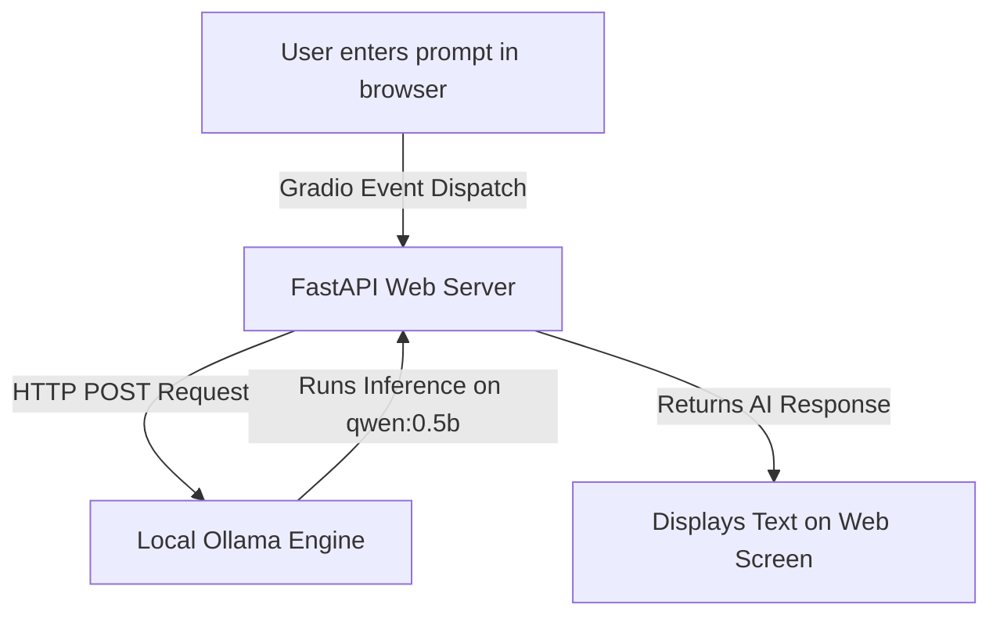

Here is the complete, professional, easy-to-understand **`README.md` for [farahhhm/local-llm-web-interface](https://github.com/farahhhm/local-llm-web-interface)**:

***

# 🤖 Local LLM Web Interface (`local-llm-web-interface`)

A fast, lightweight, and **100% private** web application interface for running and chatting with open-source Large Language Models (LLMs) locally on your computer via **Ollama** (default model: `qwen:0.5b`).

Built using **FastAPI** as the backend web server framework and **Gradio** for an interactive browser interface.

---

## 📌 How the Web Interface Works (Workflow Diagram)

---

## 🌟 Key Features

- 🔒 **100% Local & Private**: Prompt processing and text generation happen entirely on your computer's hard drive. No data is sent to external cloud APIs.
- 💬 **Interactive Chat UI**: User-friendly browser interface built with Gradio (textbox prompt input, model selector dropdown, and output display).
- ⚡ **FastAPI Server Integration**: Gradio UI is mounted directly onto a FastAPI web server running via Uvicorn.
- 🎛️ **Model Selector**: Built-in dropdown menu to switch between local Ollama models.
- ✈️ **Offline Capable**: Works completely offline without requiring an internet connection once models are downloaded.

---

## 📂 Repository File Breakdown

- **`app/main.py`**: Primary Python script housing all application logic, FastAPI server setup, and Gradio UI integration.
- **`requirements.txt`**: Environment manifest listing required Python dependencies (`fastapi`, `uvicorn`, `gradio`, `requests`, `python-dotenv`).
- **`Screenshot 2025-11-05 123045.png`**: Interface screenshot preview demonstrating the live web UI.
- **`README.md`**: Technical project documentation.

### Simple Explanation of `app/main.py`:
* **Ollama Connection (`generate_text`)**: Formulates and sends `POST` requests to Ollama's local REST API (`http://localhost:11434/api/generate`) with your prompt and chosen model (`qwen:0.5b`).
* **Gradio Interface (`gui`)**: Renders browser input textboxes, model dropdown menus, and output response boxes.
* **FastAPI Mount (`app`)**: Uses `gr.mount_gradio_app` to serve the Gradio UI at the root path (`/`) on `127.0.0.1:8000`.

---

## 🛠️ Technology Summary

| Component | Tool Used | Role in Project |
|---|---|---|
| **Frontend UI** | Gradio (`v4.28.3`) | Interactive browser-based UI for prompt input & text output |
| **Backend API** | FastAPI | High-performance Python web framework hosting the app |
| **ASGI Web Server** | Uvicorn | Asynchronous web server running on port `8000` |
| **LLM Engine** | Ollama | Local server serving AI models at `http://localhost:11434` |
| **Default Model** | Qwen (`qwen:0.5b`) | Lightweight 0.5B parameter open-weights language model |
